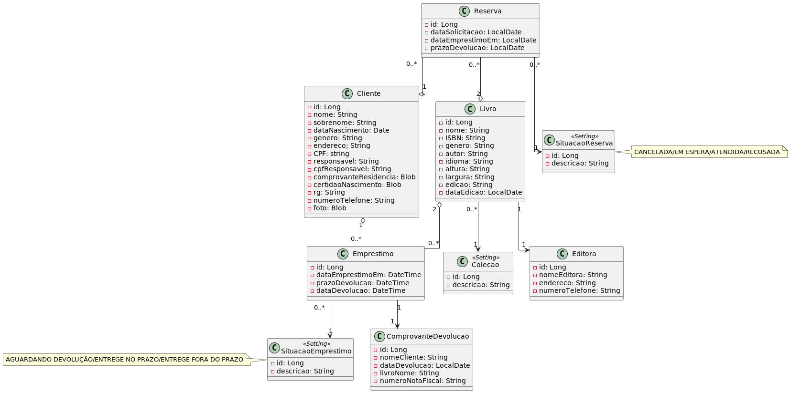

# Bibly - Sistema de Gerenciamento de Empréstimo de Livros Para Bibliotecas

## Objetivo do Bibly

O objetivo do bibly é servir de apoio para que bibliotecários possam fazer o gerenciamento de empréstimos de seus livros. O Sistema bibly permite:

## Funcionalidades

- Registrar os livros do catálogo
- Monitorar as entradas e saídas dos livros emprestados
- Organizar a listagem de livros por gênero
- Cadastrar os solicitantes de livros
- Aceitar solicitação de empréstimos de livros dos solicitantes cadastrados

## Diagrama de Classes

## Arquitetura

A arquitetura consiste em uma REST API construída em Java e Spring Framework com os componentes:

- Spring Data JPA, para acesso ao banco de dados
- Spring Boot, para inicialização do projeto sem a necessidade de 
enviar o projeto para um servlet container manualmente 

Além de um banco de dados PostgreSQL criado a partir de um container Docker

